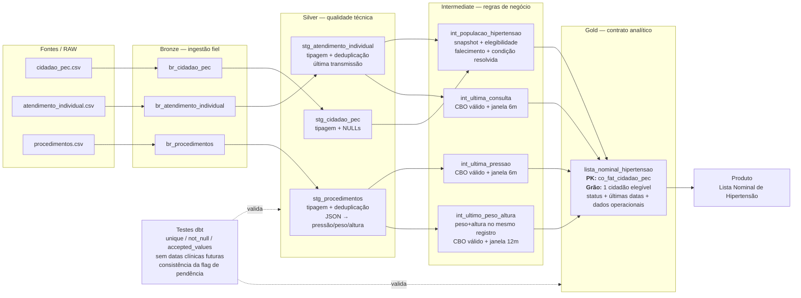

# Arquitetura do pipeline — Lista Nominal de Hipertensão

**Objetivo:** transformar os três arquivos brutos do e-SUS PEC em uma tabela Gold com **uma linha por cidadão elegível**, pronta para alimentar a Lista Nominal de Hipertensão
**Data de referência** `2026-08-01`



## Onde as regras são aplicadas

| Camada | Responsabilidade | Principais decisões |
|---|---|---|
| **Bronze** | Preservar o dado recebido | Leitura dos CSVs sem aplicar regra de negócio |
| **Silver** | Corrigir estrutura técnica | Tipagem; strings vazias → `NULL`; deduplicação pela transmissão mais recente; extração de `pressao_arterial`, `peso` e `altura` do JSON |
| **Intermediate** | Aplicar semântica de saúde | estado mais recente de hipertensão; exclusão de falecidos; filtros de CBO; última ocorrência válida; janelas de 6 ou 12 meses; status `Em dia`, `Atrasada`, `Nunca realizada` |
| **Gold** | Entregar contrato estável ao Produto | sinalização de nome/nascimento inválidos; flag `st_possui_pendencia`. Microárea não é criada porque não existe nas fontes       |

## Schema da Gold

**Tabela:** `lista_nominal_hipertensao`  
**Granularidade:** uma linha por cidadão elegível no snapshot.  
**Chave primária:** `co_fat_cidadao_pec`.

```text
co_fat_cidadao_pec          BIGINT       PK
no_cidadao                  VARCHAR      nullable
st_nome_ausente             BOOLEAN
dt_nascimento               DATE         nullable
idade                        INTEGER      nullable
st_data_nascimento_invalida BOOLEAN
nu_cns                       VARCHAR      nullable
nu_cpf_cidadao               VARCHAR      nullable
nu_telefone_celular          VARCHAR      nullable
nu_ine                       VARCHAR      nullable
no_equipe                    VARCHAR      nullable

dt_ultima_consulta           DATE         nullable
status_consulta              VARCHAR      {Em dia, Atrasada, Nunca realizada}

dt_ultima_pressao            DATE         nullable
valor_ultima_pressao         VARCHAR      nullable
status_pressao               VARCHAR      {Em dia, Atrasada, Nunca realizada}

dt_ultimo_peso_altura        DATE         nullable
ultimo_peso                  DECIMAL(10,2) nullable
ultima_altura_cm             DECIMAL(10,2) nullable
status_peso_altura           VARCHAR      {Em dia, Atrasada, Nunca realizada}

st_possui_pendencia          BOOLEAN
data_referencia              DATE
```

